**ICT171 – Assignment 2: Documentation of WordPress as IaaS**
<p>
Tim Fausten

Student ID: 34492493

AWS public DNS: http://ec2-13-238-207-70.ap-southeast-2.compute.amazonaws.com/

Public / elastic IP address: 13.238.207.70

Domain name: www.networking-blog.com 
</p>

</br>


**1. Log-in to AWS EC2 and Launch an instance**
<p>
•	Log-in with your credentials here: http://aws.amazon.com/ec2/

•	Click on “Launch Instance”.

•	Give the new instance a name (“WordPress”).

•	Choose Ubuntu Server 24.04 LTS as Amazon Machine Image.

•	Choose the t2.micro as Instance Type.

•	For the Key Pair, click “create new key pair” for the login and enter a name (“WordPress-key”). Leave the key-pair type as RSA and the file format as .pem.

•	The key will then be downloaded and saved in the Downloads folder.

•	Click on “Edit” for the network settings to create a new security group. Call it “WordPress-SecurityGroup” and enable SSH, HTTP and HTTPS for the webserver.

•	Leave the 30GB of storage under “Add Storage”.

•	Review the summary and click on the orange “Launch Instance” button.

•	You should then see a green success message.


You can then connect to your instance using SSH.

•	Click on “Connect to instance” and choose “SSH Client”.

•	Open your terminal

•	Enter the command to change the permissions of the key file.

•	Enter the command to remotely access the WordPress instance via SSH and accept the fingerprint.

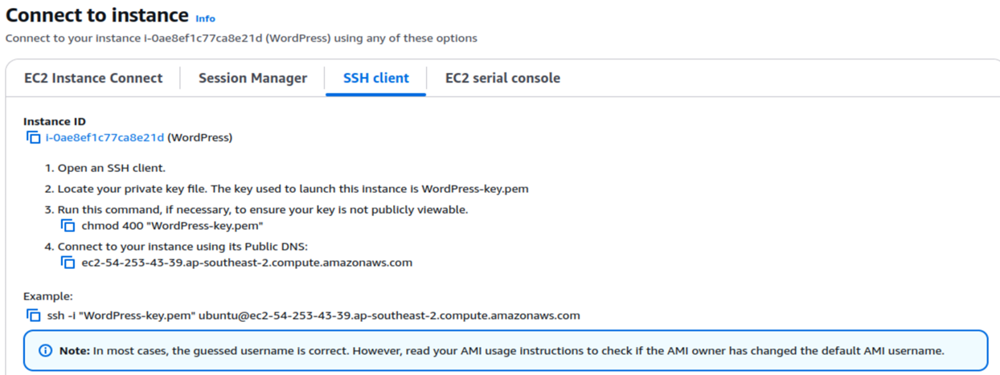
</p>
</br>


**2. Install the Apache webserver**
<p>
•	Before installing Apache, update the apt repository by typing the following command into the terminal:
```markdown
sudo apt update
```
•	Install the Apache webserver using the following command:
```markdown
sudo apt install apache2
```
</p>
</br>

**3. Ensure that the IP address is static**
<p>
•	Navigate back to your Amazon EC2 Dashboard and scroll down until you see “Elastic IPs” under the Network & Security heading on the left side and click on it.

•	Click on “Allocate Elastic IP addresses” and keep the defaults (Amazon’s pool of IPv4 addresses and ap-southeast-2 as network border group) and click on “allocate”.

•	Click on the allocated IPv4 address and then choose “Associate Elastic IP address”.
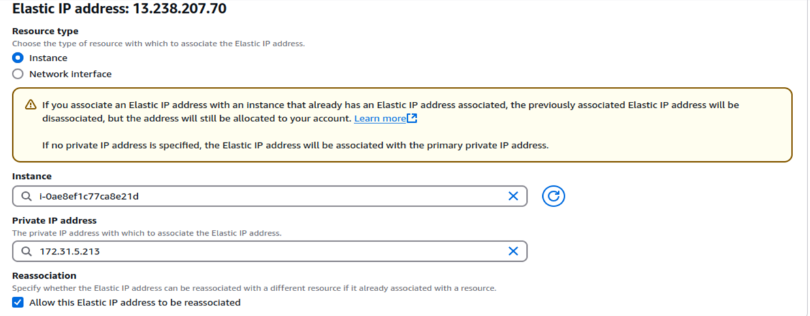
•	Choose the WordPress instance and the allocated private IPv4 address to associate the elastic IPv4 address with.
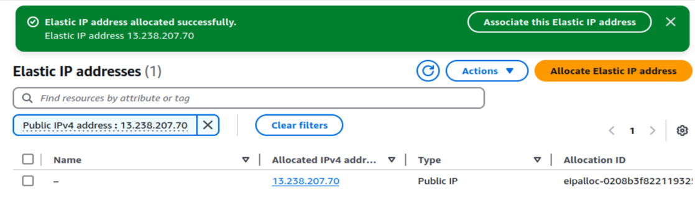
</p>
</br>
 


**4. Test if the Apache installation and assignment of public IP address work**
<p>
To test if Apache has been installed successfully and the elastic IPv4 address has been allocated, find out the public IPv4 DNS of the WordPress instance from the AWS EC2 instance details.
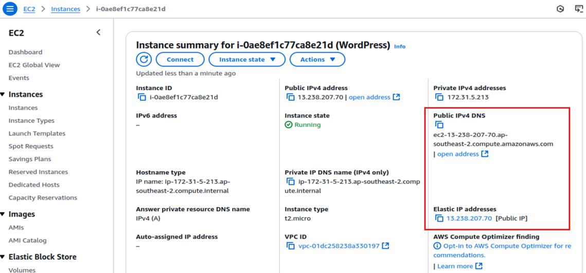
When you copy the static public IPv4 address and the public IPv4 DNS address into a web browser, it should show the Apache Default page.

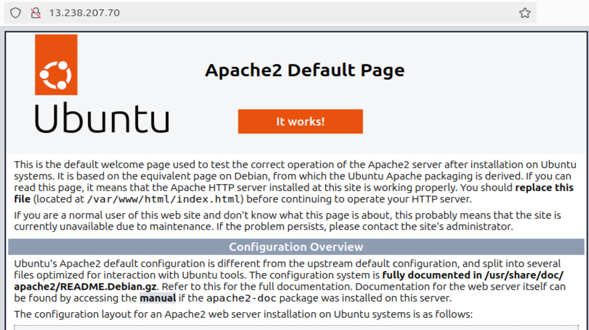
</p> 
</br>


**5. Buy a domain name from Amazon Route 53**
<p>
•	In the AWS Dashboard search tool, search for Route 53 and click “Get started” to register a domain.

•	Follow the steps in AWS to check if the domain name is available, enter your personal details, agree to Terms and Conditions and make the payment.
</p>
</br>
 


**6. Map the domain name to the IP address**
<p>
•	In Amazon Route 53 got to “Hosted Zones”, click on the domain name and then “Create Record”.

•	Then create an A record for the domain and map it to the static public IP address created earlier.
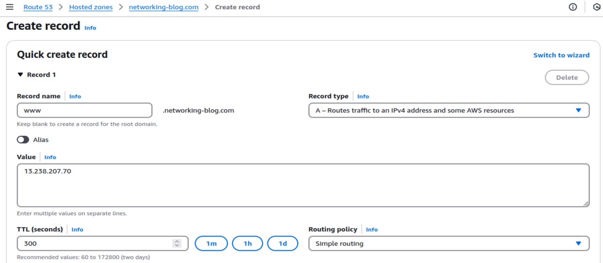
•	To test if the domain name has been mapped, enter the URL into a web browser. It should display the default web page again.
</p>
</br>


**7. Install an SSL certificate from Let’s Encrypt using Certbot**
<p>
•	Connect to the EC2 instance via SSH

•	Install additional snapd repositories by using these commands:
```markdown
sudo snap install core
sudo snap refresh core
```
•	If the Certbot package is already installed, remove it by using this command:
```markdown
sudo apt-get remove certbot
```
•	Install Certbot using this command:
```markdown
sudo snap install --classic certbot
```
•	To make sure that the certbot command can be run, enter the following command:
```markdown
sudo ln -s /snap/bin/certbot /usr/bin/certbot
```
•	Run the following command to get a certificate, install it and to turn on HTTPS access:
```markdown
sudo certbot --apache
```

•	Follow the prompts to accept the license and enter the domain name (www.networking-blog.com, networking-blog.com)

•	You should now see a success message
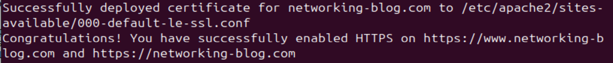
•	To check whether the SSL certificate has been successfully installed, navigate to the website and check if it displays HTTPS in the URL and the lock symbol


Source for installing the SSL certificate: Certbot, certbot.eff.org, https://certbot.eff.org/instructions?ws=apache&os=snap&tab=standard
</p>
</br>


**8. Install and configure the MariaDB database**
<p>
•	Install MariaDB server and client with the following command:

```markdown
sudo apt install mariadb-server mariadb-client -y
```


•	Start the Maria DB service and check if the service is running using the following commands:
```markdown
sudo systemctl start mariadb
sudo systemctl enable mariadb
sudo systemctl status mariadb
```


•	Set the username and password for MariaDB using the command line. First, enter the following command:
```markdown
sudo mysql_secure_installation
```


•	You will then be prompted to answer some question for the setup and security of MariaDB:

1.	When prompted for the current password of the root user press enter as currently no root password is set after freshly installing MariaDB

2.	Switch to Unix socket authentication? Y

3.	Change the root password? Y, then enter a password to set the new root password

4.	Remove anonymous users? Y

5.	Disallow root login remotely? Y

6.	Remove test database and access to it? Y

7.	Reload privilege tables now? Y


•	Restart the Maria DB service so changes come into effect:
```markdown
sudo systemctl restart mariadb
```
</p>
</br>


**9. Install PHP**
<p>
•	Install these 5 packages to install PHP and the PHP connection to the SQL database:

```markdown
sudo apt install php php-mysql php-gd php-cli php-common -y
```

</p>
</br>


**10. Download and configure WordPress**
<p>
•	Go to the following website: 

```markdown
https://en-au.wordpress.org/download/ 
```


•	Under the section “Download and install it yourself” find the “Download WordPress” button and right click on it to copy the download link

•	Use the wget command and copy the download link for WordPress after that command to download WordPress. This will download the WordPress files as a zip archive.
```markdown
wget https://en-au.wordpress.org/latest-en_AU.zip 
```
•	To unzip the file install the unzip package first and then run the unzip command:
```markdown
sudo apt install unzip
unzip latest-en_AU.zip
```

•	You should now see the wordpress folder 
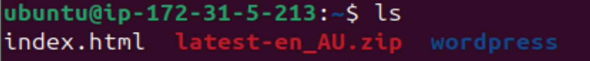

•	Copy all contents of the wordpress folder to the /var/index/html folder:
```markdown
sudo cp -r /wordpress/* /var/www/html/
```

•	Check if the files have been copied to /var/www/html/ by changing the directory and then listing the contents:
```markdown
cd /var/www/html
ls -l
```

•	Since WordPress has a built-in user called www-data, it is necessary to change the ownership of the wordpress files to this user using the following command:
```markdown
sudo chown www-data:www-data -R /var/www/html/
```

•	Ensure that the owner is changed by using this command:
```markdown
ls -l
```
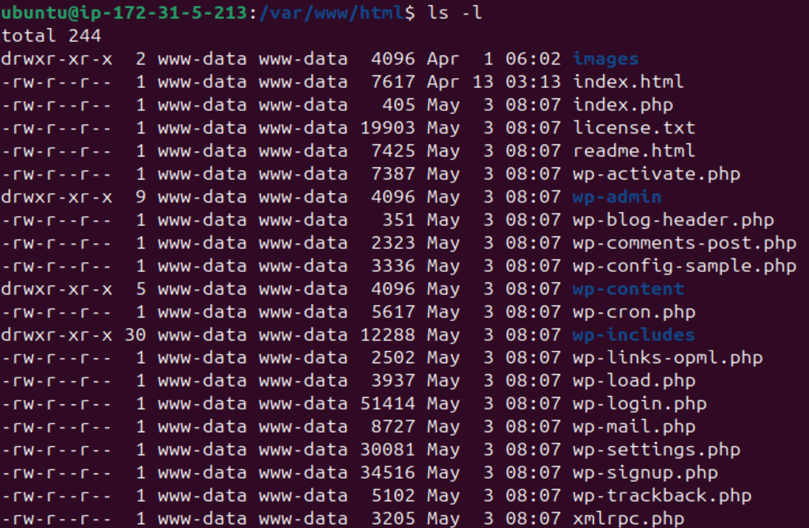

•	Next, remove the default Apache index.html so WordPress shows the actual WordPress site after setup:
```markdown
sudo rm -rf index.html
```

•	To start the installation of Wordpress, open a web browser and type in your URL (in this case www.networking-blog.com). You should be redirected to the wp-admin page from WordPress and then see this page:
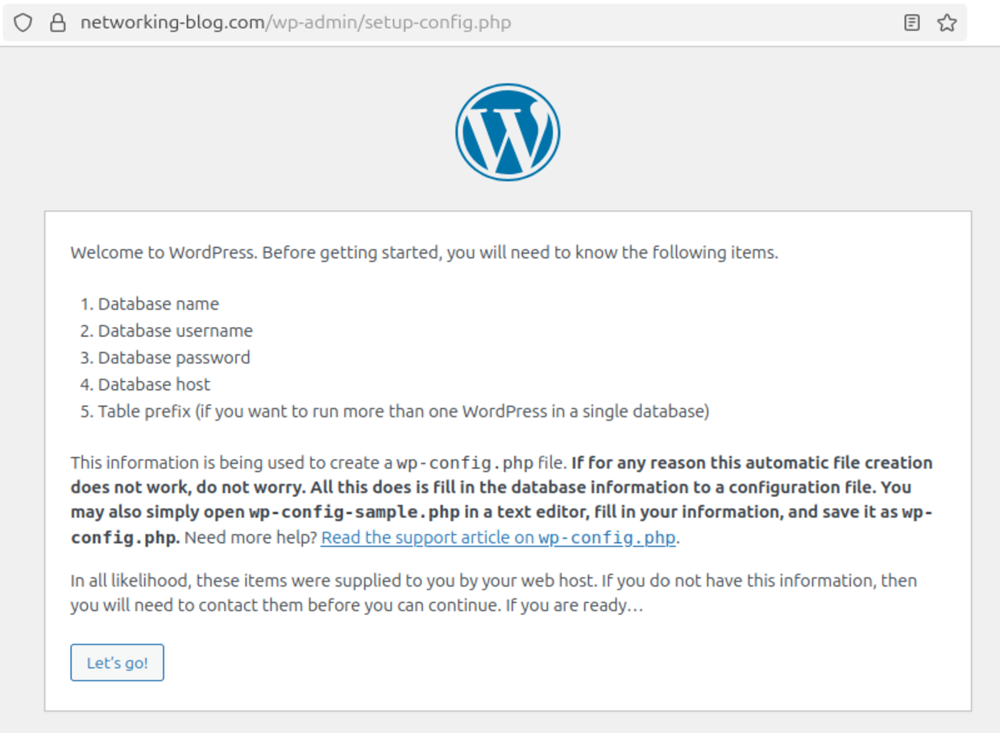

•	Before continuing the setup, first create the database, username and password which are needed to continue the WordPress setup in the browser.

•	Use the following command to log in to the MySQL database with the root user. You will then be prompted to enter the password that you crated earlier during the installation of MariaDB.
```markdown
mysql -u root -p
```

•	At the MariaDB [(none)] prompt enter the following to create a database name wordpress:
```markdown
create database wordpress;
```

•	Create the username and password (create your own username and password):
```markdown
create user “wpadmin” identified by “wpadminpassword”;
```

•	Grant privileges to the wpadmin user for all objects in the wordpress database:
```markdown
grant all privileges on wordpress.* to “wpadmin”;
```


•	Go back to the WordPress setup in your browser , click “Let’s go!” and enter the database name, username and password that you have just created

•	Leave the options for the database host as localhost and the table prefix as wp_ and click “Submit”

•	On the next page you should see a message that WordPress can now communicate with the database. Click “Run the installation” to continue

•	Enter the title of your WordPress page, enter a username and password to access the WordPress admin console and your email address and click “Install WordPress”

•	The installation is now complete, and you can login to the WordPress admin console to administer the WordPress site. Click on the name of your page to view the sample site and to confirm that the installation was successful.
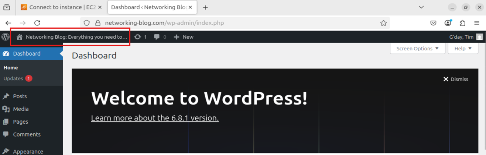

•	The sample page is shown. Note that the URL is networking-blog.com (without the /wp-admin/ at the end) and it is using HTTPS as configured in step 7.
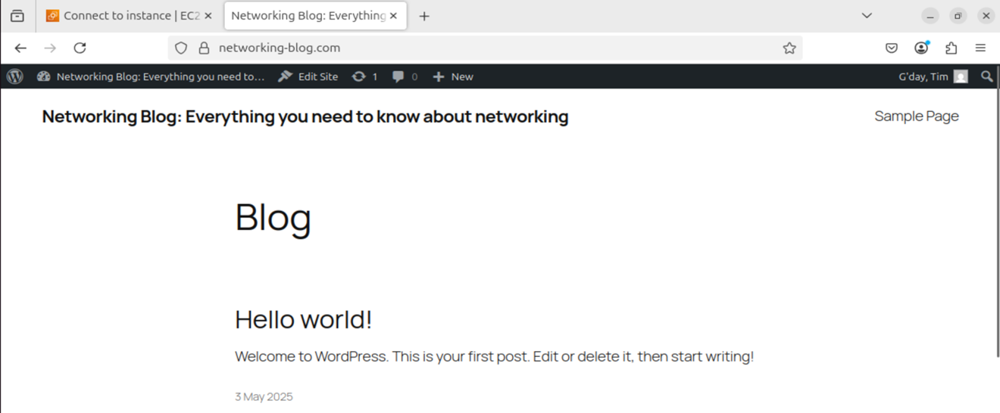

</p>
</br>

Steps 7 to 9 were taken from this source and were partially adapted:
Alok Kumar (2022), AWS - Installing WordPress on EC2(ubuntu) - Complete LAMP setup with step by step instructions, https://www.youtube.com/watch?v=5rlCUXjVaHE 


